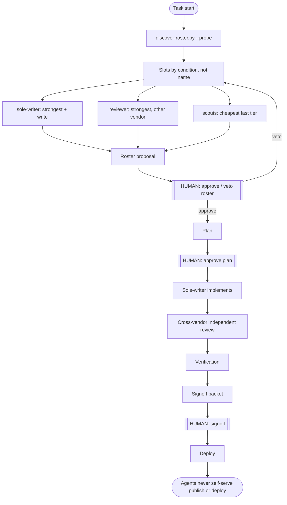

# agent-sop

A human-gated, capability-slotted collaboration workflow (SOP) for coding agents.

[中文说明 →](README.zh.md)

The goal is not to make agents more autonomous — it is to pick the right process weight for each risk level, so that work stays traceable, reviewable, and signable without small tasks drowning in ceremony.

High-risk work follows the full auditable sequence:

```text
research → plan → human approval → implementation → independent review
        → verification → signoff packet → human signoff → deploy
```

Low-risk work runs a deliberately lighter path. Tiers and boundaries are defined in `SKILL.md` §1.1.

## How it works



## Design principles

- **Agent-first.** Skills are operated by agents, not hand-configured by humans. The skill guides an agent to detect its environment, write its own configuration, and ask the human only for decisions. A step that requires a human to edit files by hand is a design bug.
- **Discovered roster, never a hardcoded one.** At task start the orchestrator runs `scripts/discover-roster.py --probe` to find the coding-agent CLIs actually installed and healthy on the machine, then assigns capability slots **by condition, never by name** (see `references/roster-protocol.md`). Install a new agent CLI and it joins the pool on the next run, with zero skill edits.
- **Capability slots, not fixed roles.** `orchestrator`, `sole-writer`, `reviewer`, `scout` — exactly one writer per repo at a time; reviewers are read-only and, whenever possible, from a **different vendor** than the writer (independence degradation ladder documented and recorded when full independence is unavailable).
- **Humans own decisions; gates are structural.** Publish/deploy/data-write steps are never self-served by an agent. The orchestrator splits dispatched work at every gate; approval is explicit — silence is never approval. Signoff status can only be set to `approved` by a human, and agents recording it must quote the human verbatim.
- **Claims require evidence.** "Tests passed" without commands and captured output is treated as unverified. Reviewers re-run security-relevant checks instead of trusting the writer's summary.

## Files

- `SKILL.md` — the workflow itself (English), written to be loaded by an agent as a skill.
- `references/roster-protocol.md` — roster discovery, condition-based slot assignment, reviewer-independence ladder, `roster.json` schema.
- `references/review-checklist.md` — independent review checklist with a reusable VERDICT/BLOCKING/SUGGESTED/EVIDENCE contract.
- `scripts/discover-roster.py` — agent CLI discovery with optional live health probes (catches expired auth and provider outages *before* work is assigned).
- `templates/signoff-packet.md` — Markdown signoff packet template (Chinese; structure is language-neutral).

## Install

Symlink (or copy) this directory into your agent's skills directory, e.g.:

```bash
ln -s /path/to/agent-sop ~/.claude/skills/sop
```

Any agent runtime that loads Markdown skills works the same way; the workflow itself is agent-agnostic.

## Provenance

This workflow is used in production by its authors, and it was used to produce itself: the roster-discovery redesign and this public release each ran through the full pipeline — plan, sole-writer implementation, cross-vendor independent review, verification, signoff — before shipping.

## License

MIT — see [LICENSE](LICENSE).
