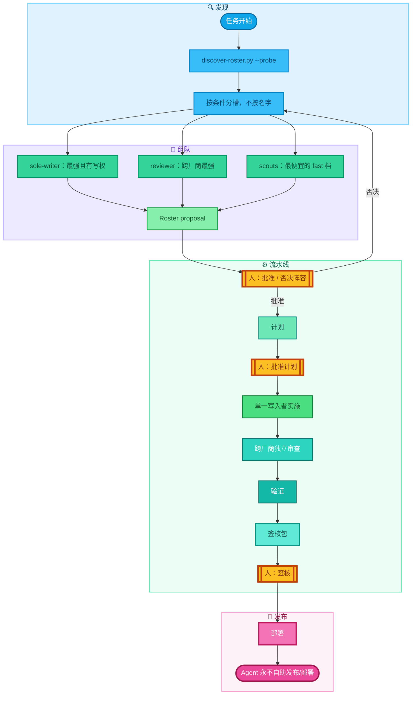

# agent-sop

一个"人类守门、按能力分槽"的多 Agent 协作 SOP。

[English README →](README.md)

目标不是让 Agent 更自由，而是按风险选择合适的流程重量，让过程可追踪、可审查、可签核，同时避免小任务被完整仪式拖慢。

高风险任务使用完整流程：

```text
研究 → 计划 → 人工批准 → 单一写入者实施 → 独立 Review → 验证 → Markdown 签核文件 → 人工签核 → 部署
```

低风险任务走刻意减重的轻流程，分级边界见 `SKILL.md` §1.1。

## 工作原理



## 设计原则

- **Agent 优先**：skill 由 Agent 操作，不靠人手工配置。Agent 自己探测环境、自己写配置，人只做决策。任何需要人手工改文件的步骤都是设计缺陷。
- **阵容发现而非声明**：任务开始时 orchestrator 跑 `scripts/discover-roster.py --probe`，现场发现本机装了哪些 Agent CLI、各自健康与否，然后**按条件（不按名字）**分配槽位（规则见 `references/roster-protocol.md`）。装了新 Agent，下次运行自动入队，零改动。
- **能力槽位，不是固定角色**：`orchestrator`、`sole-writer`、`reviewer`、`scout`。一个仓库同时只有一个写入者；审查者只读，并尽量来自与写入者**不同的厂商**（无法完全独立时按降级阶梯记录）。
- **决策属于人，闸门是结构性的**：发布/部署/数据写入永远不能由 Agent 自助完成。orchestrator 在每个闸门处拆分派工；批准必须明确——沉默不是批准。签核状态只有人能改成 `approved`，Agent 代记录时必须逐字引用人的原话。
- **主张需要证据**："测试通过"没有命令和输出就视为未验证。安全相关的检查由审查者重跑，而不是相信写入者的总结。

## 文件

- `SKILL.md`：英文主 Skill（供 Agent 加载）。
- `references/roster-protocol.md`：阵容发现、按条件分槽、审查独立性降级阶梯与 roster.json 字段说明。
- `references/review-checklist.md`：独立审查清单（VERDICT/BLOCKING/SUGGESTED/EVIDENCE 契约）。
- `scripts/discover-roster.py`：Agent CLI 发现脚本（`--probe` 实测健康度，可在派工前捕获认证过期/服务商故障）。
- `templates/signoff-packet.md`：中文 Markdown 签核文件模板（结构与语言无关）。

## 安装

把本目录软链（或复制）进你的 Agent skills 目录，例如：

```bash
ln -s /path/to/agent-sop ~/.claude/skills/sop
```

任何加载 Markdown skill 的 Agent 运行时都同样适用；工作流本身与具体 Agent 无关。

## 出处

这套流程是作者的日常生产流程，而且它自己就是自己产出的：动态点名改造和这次公开发布，各自完整走了一遍"计划 → 单写者实施 → 跨厂商独立审查 → 验证 → 签核"后才上线。

## License

MIT，见 [LICENSE](LICENSE)。
